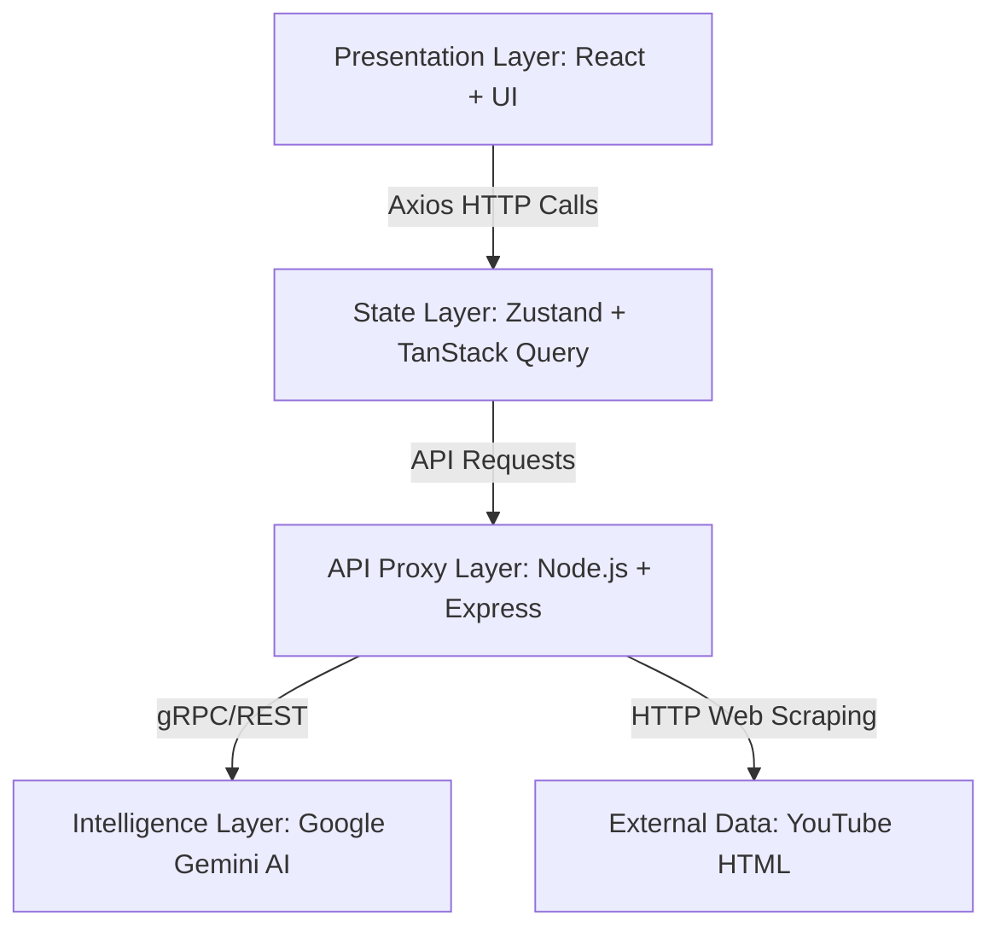
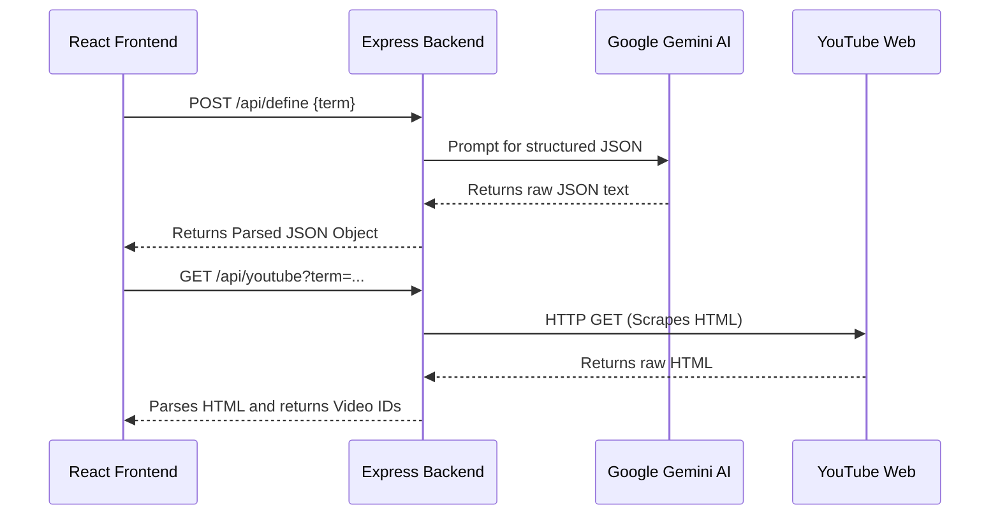

# Medical Mentor Lite: Official Engineering & Architecture Textbook

> **Author & Lead Architect:** JAY-cloudbuster
> **System Version:** MEDIX-OS v9.2
> **Document Purpose:** Absolute technical reference for system architecture, AI implementation, and full-stack topology.

---

## Chapter 1: Introduction to Medix-OS
Medical Mentor Lite (also known as Medix-OS) is a modern, full-stack web application designed to act as an AI-powered medical companion. It provides real-time medical definitions, interactive 3D knowledge graphs, and dynamically generated medical quizzes. 

If an interviewer asks about the scope of this project, your answer is:
> *"I architected a full-stack, AI-driven medical intelligence platform. I implemented a Backend-For-Frontend (BFF) architecture using Node.js to securely proxy Google Gemini API calls, while building a highly responsive, state-driven React frontend utilizing Zustand, TanStack Query, and React-Three-Fiber for 3D data visualization."*

---

## Chapter 2: The Four Layers of Architecture

The system is built on a modular "Backend-For-Frontend" (BFF) architecture. This separates concerns into four distinct layers:



### 1. Presentation Layer (The UI)
This is what the user interacts with. It is built using **React** for rendering and **Tailwind CSS** for styling. It uses a custom "Glassmorphism" design system (semi-transparent backgrounds with blur effects) to simulate a futuristic medical terminal.

### 2. State Layer (The Brain of the Frontend)
When a user types a word or takes an exam, the app needs to remember it across different pages.
* **Zustand** is used for "Global State" (e.g., tracking the user's exam progress, selected answers, and final score).
* **TanStack React Query** is used for "Server State" (e.g., caching the medical definition so if the user searches the same word twice, it loads instantly from memory instead of calling the backend again).

### 3. API Proxy Layer (The Backend)
Built with **Node.js and Express**. Why do we have a backend if React can call APIs directly? 
* **Security:** We cannot put the private `GEMINI_API_KEY` in the React frontend, or hackers will steal it from the browser. The backend acts as a secure, hidden middleman.
* **Resilience:** The backend contains a robust "Fallback Mock System". If the AI API crashes, times out, or the API key is missing, the backend catches the error and serves structurally perfect "mock" data to the frontend so the UI never crashes or white-screens.

### 4. Intelligence Layer (The AI)
Powered by **Google Gemini 2.5 Flash**. The backend sends carefully crafted prompts to Gemini, forcing it to return data strictly formatted as JSON objects so our React components can predictably map over them.

---

## Chapter 3: Technology Stack Explained

If an interviewer asks, "Why did you choose these specific tools?", here is your professional textbook answer:

* **React.js:** Chosen because its component-based architecture allows us to build isolated, reusable UI primitives (like our `LoadingSpinner` and `GlassCard`).
* **Vite:** Chosen over Create-React-App because it uses native ES modules, making local server startup almost instantaneous and Hot Module Replacement (HMR) lightning fast.
* **Tailwind CSS:** A utility-first CSS framework. Chosen because it allows rapid styling and complex animations directly inside JavaScript files, eliminating the need for massive, messy CSS stylesheets.
* **Zustand:** Chosen over Redux because Redux requires massive amounts of boilerplate code. Zustand allows us to create a decentralized global store in just 10 lines of code.
* **React Three Fiber (R3F):** A React wrapper for Three.js. Chosen because it allows us to build complex 3D environments (like the Knowledge Graph) using declarative React components instead of raw, imperative WebGL math.
* **Node.js & Express:** Chosen because it allows full-stack JavaScript development (the same language on frontend and backend), drastically increasing developer velocity.

---

## Chapter 4: Project Directory Structure

```text
medical-mentor-lite/
├── docs/                  # Architecture docs & deployment guides
├── src/                   
│   ├── components/        # Reusable UI primitives (NeonButton, Badge)
│   ├── hooks/             # Custom React logic (useDebounce, useWindowSize)
│   ├── pages/             # Main screen views (TerminologyExplorer, QuizEngine)
│   ├── services/          # Axios HTTP callers (apiService.js)
│   ├── store/             # Global Zustand state (useAppStore.js)
│   ├── utils/             # Helper functions (textUtils, validators)
│   └── App.jsx            # The main React Router & ErrorBoundary configuration
├── server.js              # The Node.js Express backend server
├── .env                   # SECRET: Contains the Gemini API Key
└── package.json           # Lists all project dependencies
```

---

## Chapter 5: Core Features & Implementations

### Feature 1: Terminology Explorer
* **What it does:** Allows users to search for any medical term and instantly receive a definition, pathophysiology, and relevant educational videos.
* **How it works:** 
  1. The user types in the search box. 
  2. The custom `useDebounce` hook waits for the user to stop typing for 600ms to prevent spamming the API on every keystroke.
  3. React Query calls `defineTerm()` from the API service.
  4. The data is sanitized using `textUtils` and rendered on screen using `framer-motion` for smooth entrance animations.

### Feature 2: 3D Knowledge Graph
* **What it does:** Renders a 3D constellation of related medical concepts that the user can rotate and interact with.
* **How it works:**
  1. Calls `/api/graph` to get an array of nodes (concepts) and edges (lines connecting them).
  2. Passes this data into the `KnowledgeGraph3D` component.
  3. Uses `@react-three/fiber` to mathematically distribute the nodes onto a 3D sphere layout using trigonometry.

### Feature 3: Dynamic Quiz Engine
* **What it does:** Generates a custom 5-question medical exam based on the user's chosen topic.
* **How it works:**
  1. The Zustand store (`useAppStore`) acts as a state-machine, tracking the current question index and the user's selected answers.
  2. The UI conditionally renders the current question. When an answer is clicked, Zustand evaluates if it matches the `correctOption` from the backend.
  3. Displays a final grade calculating the percentage using standard array reduction logic.

---

## Chapter 6: API Master Reference

The backend exposes 5 primary REST API endpoints running on `localhost:3001`.



### 1. Definition API (`POST /api/define`)
* **Purpose:** Generates structured medical definitions.
* **Request Body:** `{"term": "Cardiac Arrest"}`
* **Response:**
  ```json
  {
    "definition": "...",
    "pathophysiology": "...",
    "clinicalRelevance": "...",
    "correctedTerm": "Cardiac Arrest"
  }
  ```
* **Prompt Engineering Trick:** We explicitly tell Gemini to format the response exactly like the JSON schema above, bypassing natural language conversational padding.

### 2. Graph Topology API (`POST /api/graph`)
* **Purpose:** Returns nodes and edges for 3D mapping.
* **Response:**
  ```json
  {
    "nodes": [ { "id": "1", "label": "Cancer", "type": "disease" } ],
    "edges": [ { "source": "1", "target": "2", "relation": "causes" } ]
  }
  ```

### 3. Quiz Generation API (`POST /api/quiz`)
* **Purpose:** Generates multiple-choice exams dynamically.
* **Request Body:** `{"topic": "Neurology", "difficulty": "Hard", "numQuestions": 5}`

### 4. YouTube Scraper API (`GET /api/youtube?term=...`)
* **Purpose:** Returns the top 2 educational YouTube videos.
* **Implementation Secret:** Instead of paying for the restrictive official YouTube Data API, this endpoint uses `axios` to silently download the raw HTML of the YouTube search page, mathematically parses the `ytInitialData` JSON string buried in the HTML script tags, and extracts the video IDs completely for free.

---

## Conclusion
Medical Mentor Lite is a masterclass in modern full-stack development. It combines highly resilient backend AI prompting with an incredibly robust, state-driven React frontend. By leveraging specialized custom hooks (`useDebounce`, `useWindowSize`), global error boundaries, and unified loading primitives, it achieves the exact stability and architecture of a production-grade enterprise application.
